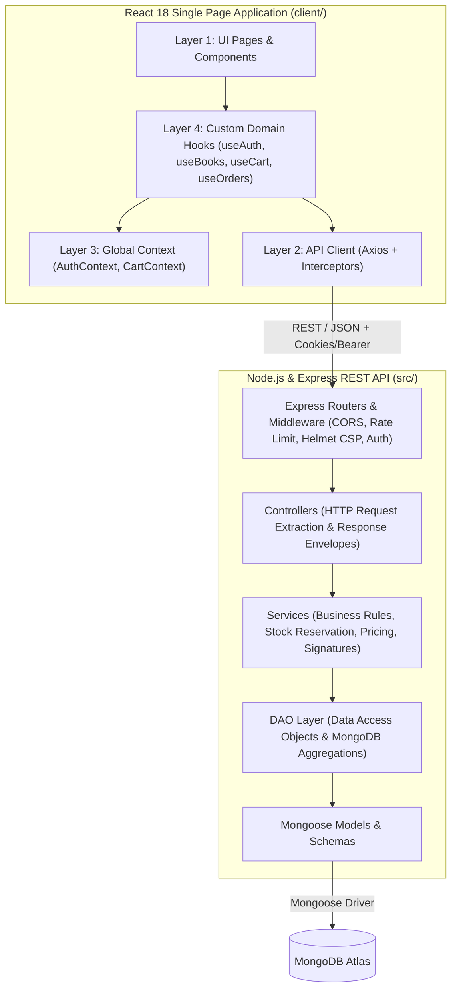

<p align="center">
  <a href="https://github.com/aaryan174/BookWORM">
    
  </a>
</p>

<h1 align="center">BookWORM — Archival & Multi-Vendor Book Marketplace</h1>

<p align="center">
  <em>A production-grade, multi-vendor literary marketplace that decouples canonical book catalogs from independent seller inventories with verified condition authentication, atomic stock reservations, and Razorpay checkout.</em>
</p>

<p align="center">
  <a href="#tech-stack"></a>
  <a href="#tech-stack"></a>
  <a href="#tech-stack"></a>
  <a href="#tech-stack"></a>
  <a href="#tech-stack"></a>
  <a href="#tech-stack"></a>
  <a href="#deployment"></a>
  <a href="#license"></a>
</p>

---

## 📑 Table of Contents
- [Executive Overview](#-executive-overview)
- [Key Features](#-key-features)
- [System Architecture](#-system-architecture)
- [Tech Stack](#-tech-stack)
- [Repository Structure](#-repository-structure)
- [Database Schema & Entity Relations](#-database-schema--entity-relations)
- [REST API Endpoints](#-rest-api-endpoints)
- [Security & Financial Integrity](#-security--financial-integrity)
- [Getting Started Locally](#-getting-started-locally)
- [Default Test Credentials](#-default-test-credentials)
- [Automated Testing](#-automated-testing)
- [Production Deployment (Render)](#-production-deployment-render)
- [Extended Documentation](#-extended-documentation)
- [License](#-license)

---

## 🌟 Executive Overview

Unlike standard single-vendor e-commerce stores, **BookWORM** is engineered as a true **multi-vendor exchange**. 

The core architectural innovation is the **decoupling of the canonical book catalog from individual seller listings**:
- **Canonical Books:** Represent the global, immutable bibliographic work (Title, Author, ISBN-13, Publisher, Synopsis, Category).
- **Seller Listings:** Multiple independent bookstores and collectors can offer the same physical title at varying prices, conditions (*New, Like New, Very Good, Good, Collector's Edition*), and inventory levels.

Buyers benefit from transparent price comparison and condition evaluation, while sellers receive a dedicated inventory dashboard, order fulfillment pipeline, and automated net earnings calculation after platform commission.

---

## ✨ Key Features

### 👤 Buyer Experience
* **Curated Archival Catalog:** Real-time search across titles, authors, categories, and ISBN-13 with pagination, sorting, and tag filters.
* **Multi-Listing Comparison:** Inspect multiple seller offerings for any single title, compare conditions, seller ratings, and stock.
* **Shopping Cart & Inventory Validation:** Live stock check ensures items cannot be purchased beyond available seller inventory.
* **Integrated Razorpay Checkout:** Server-calculated order totals (subtotal, platform fee, tax, shipping thresholds) with cryptographic HMAC-SHA256 signature verification.
* **Order Tracking & Reviews:** Real-time order status tracking (`PAID` ➔ `CONFIRMED` ➔ `SHIPPED` ➔ `DELIVERED`) with post-purchase review submissions.

### 🏪 Seller Guild Platform
* **Instant Onboarding:** Registered users can apply to sell without separate accounts.
* **Listing Management:** Attach listings to existing catalog titles or create new canonical book definitions with cover images.
* **Stock & Pricing Control:** Update active inventory, pricing, condition notes, and listing visibility with immediate storefront synchronization.
* **Order Fulfillment:** Receive order notifications, manage shipping transitions, and attach tracking references.
* **Financial Ledger:** Track gross volume, platform commission deductions, and net seller payout balances.

### 🛡️ Administration & Moderation
* **Platform Overview:** High-level metrics for sales volume, platform commissions, active listings, and user accounts.
* **Listing Moderation:** Audit, verify, or deactivate suspicious or counterfeit listings.
* **Role Governance:** Grant or revoke administrative and seller capabilities.

### 🎨 Visual & Performance Highlights
* **Apple-Inspired Typography & Glassmorphism:** San Francisco-style type hierarchy using Inter, curated palettes, and backdrop blur panels.
* **Custom Mascot Identity:** Round, retina-ready BookWORM emblem with instant preloading (<5ms decode time, 0 CLS).
* **Chrome Tab Favicon Suite:** Multi-resolution icons (`favicon.svg`, `favicon-32x32.png`, `apple-touch-icon.png`).
* **Mobile-Responsive Navigation:** Full slide-out navigation tray and touch-friendly controls across smartphones, tablets, and desktops.

---

## 🏛️ System Architecture

BookWORM enforces a strict separation of concerns across both backend and frontend layers:



### Backend: Controller-Service-DAO Pattern
* **Controllers (`src/controllers/`):** Pure HTTP handlers that validate input, delegate logic to services, and send standard JSON envelopes.
* **Services (`src/services/`):** Encapsulate all business rules, authorization checks, financial calculations, and third-party integrations (Razorpay, ImageKit).
* **DAOs (`src/dao/`):** Isolate database operations, Mongoose queries, index utilization, and projections from business logic.

### Frontend: 4-Layer Feature Architecture
* **Layer 1 (UI):** Modular React components and responsive page views (`src/features/*/pages/`).
* **Layer 2 (API):** Feature-scoped API client calls wrapping Axios (`src/features/*/api/`).
* **Layer 3 (Context):** Reactive state providers for persistent sessions and global carts (`src/features/*/context/`).
* **Layer 4 (Hooks):** Custom hooks exposing clean interfaces to UI components (`src/features/*/hooks/`).

---

## 💻 Tech Stack

| Domain | Technology | Purpose |
| :--- | :--- | :--- |
| **Backend Runtime** | [Node.js](https://nodejs.org/) (v18+) | Non-blocking asynchronous JavaScript server environment |
| **Server Framework** | [Express.js](https://expressjs.com/) (v4.19) | RESTful API routing, middleware chaining, and static SPA serving |
| **Database & ODM** | [MongoDB Atlas](https://www.mongodb.com/) / [Mongoose](https://mongoosejs.com/) (v8.24) | Document database with schema enforcement, text indexing, and validation |
| **Frontend Framework** | [React](https://react.dev/) (v18.3) | Component-driven UI library with hooks and context |
| **Build Tool** | [Vite](https://vitejs.dev/) (v5.4) | Next-generation frontend tooling with lightning-fast HMR and optimized bundling |
| **Styling & Icons** | Vanilla CSS + [Lucide React](https://lucide.dev/) | Apple-inspired design tokens, glassmorphism, responsive CSS variables, and vector icons |
| **Payments** | [Razorpay](https://razorpay.com/) Node SDK (v2.9) | Order generation, test/live transactions, and HMAC SHA256 signature verification |
| **Image CDN** | [ImageKit](https://imagekit.io/) Node SDK (v6.0) | Cloud media storage, dynamic thumbnailing, and book cover hosting |
| **Security & Auth** | [JWT](https://jwt.io/), [bcryptjs](https://www.npmjs.com/package/bcryptjs), [Helmet](https://helmetjs.github.io/) | Dual-mode tokens (HTTP-only cookies + Bearer fallback), hashed credentials, CSP |
| **Testing** | [Jest](https://jestjs.io/), [Supertest](https://www.npmjs.com/package/supertest), [MongoMemoryServer](https://github.com/nodkz/mongodb-memory-server) | In-memory integration testing and unit testing |
| **Deployment** | [Render](https://render.com/) | Cloud platform hosting via `render.yaml` Blueprint (Unified fullstack container) |

---

## 📂 Repository Structure

```text
BookWORM/
├── client/                         # Frontend React + Vite Application
│   ├── public/                     # Static assets (favicons, round logos, manifest)
│   │   ├── logo-round.png          # High-resolution round mascot logo (512x512)
│   │   ├── logo-round-sm.png       # Ultra-fast navbar logo (96x96, 6KB)
│   │   ├── favicon.svg             # Crisp vector browser favicon
│   │   └── apple-touch-icon.png    # Mobile icon (180x180)
│   ├── src/
│   │   ├── features/               # Feature-based domain architecture
│   │   │   ├── admin/              # Admin dashboard, moderation, statistics
│   │   │   ├── auth/               # Login, registration, token recovery
│   │   │   ├── books/              # Book catalog, search filters, book details
│   │   │   ├── cart/               # Shopping cart context and drawer
│   │   │   ├── checkout/           # Multi-step checkout & Razorpay payment
│   │   │   ├── orders/             # Order history and shipment details
│   │   │   ├── profile/            # User profile and address book
│   │   │   ├── reviews/            # Rating and review submission
│   │   │   └── seller/             # Seller dashboard, listings, order fulfillment
│   │   ├── layouts/                # App layout, responsive Navbar, Footer
│   │   ├── routes/                 # Protected routes and role-based guards
│   │   ├── utils/                  # Axios apiClient with baseUrl and interceptors
│   │   ├── App.jsx                 # Route tree definition
│   │   ├── index.css               # Global typography tokens & Apple-inspired styles
│   │   └── main.jsx                # Application root entry point
│   ├── index.html                  # HTML entry with preloaded assets & favicon tags
│   ├── package.json                # Client dependencies (Vite, React, Lucide)
│   └── vite.config.js              # Vite bundler config with local dev proxy
├── docs/                           # Architecture, PRD, API, Database specifications
├── src/                            # Backend Express Application
│   ├── config/                     # Environment variables, DB, and cloud config
│   ├── controllers/                # Request validation & HTTP response envelopes
│   ├── dao/                        # Data Access Objects (Mongoose database logic)
│   ├── middlewares/                # Auth, Role guards, Rate limiter, Error handler
│   ├── models/                     # Mongoose schemas (Book, Listing, User, Order, etc.)
│   ├── routes/                     # REST API routers (/api/v1/*)
│   ├── seeds/                      # Seed script for initial books, sellers, and admin
│   ├── services/                   # Business logic, payments, order calculation
│   ├── utils/                      # AppError, standard response, async wrapper
│   ├── app.js                      # Express application assembly (Helmet, CORS, SPA static)
│   └── server.js                   # Server entry point & graceful shutdown
├── tests/                          # Automated integration & unit test suites
├── .env.example                    # Backend environment configuration template
├── package.json                    # Root scripts (start, dev, build, seed, test)
└── render.yaml                     # Turnkey Infrastructure as Code Blueprint for Render
```

---

## 🗄️ Database Schema & Entity Relations

```text
[ Canonical Book ] 1 ───< ∞ [ Seller Listing ] 1 ───< ∞ [ Order Item ]
       │                                                      │
       └───< ∞ [ Review ]                                     v
                                                        [ Order ]
[ User ] 1 ───< 1 [ Seller Profile ]                      │
   │                                                      v
   ├───────< ∞ [ Address ]                          [ Payment Transaction ]
   └───────< ∞ [ Order ]
```

### Core Data Models
* **`User`:** Identity records storing name, email, hashed credentials, roles (`buyer`, `seller`, `admin`), active state, and session references.
* **`SellerProfile`:** Business metadata for active sellers including store name, GSTIN / Tax ID, verified status, and payout settlement details.
* **`Book`:** Canonical catalog titles with ISBN-13, title, author, category, publication year, publisher, cover imagery, and aggregated rating counts.
* **`Listing`:** Inventory records binding a Seller to a Book. Stores condition (*New, Like New, Very Good, Good, Acceptable*), format, pricing, quantity, and custom images.
* **`Order` & `OrderItem`:** Atomic purchase records containing snapshot pricing, address copy, financial calculations, and fulfillment status.
* **`Payment`:** Cryptographically verified transaction records storing Razorpay Order ID, Payment ID, Signature, and reconciliation audit status.
* **`Review`:** User rating (1–5 stars) and commentary attached to canonical books.

---

## 🔌 REST API Endpoints

All endpoints are versioned under `/api/v1` and return standardized envelopes:

### Response Envelopes
```json
// Success Response (HTTP 200/201)
{
  "success": true,
  "message": "Operation completed successfully",
  "data": { ... }
}

// Error Response (HTTP 4xx/5xx)
{
  "success": false,
  "message": "Human readable error description",
  "errors": [{ "field": "email", "message": "Invalid email address" }]
}
```

### Key Endpoint Contracts

| Scope | Method | Endpoint | Description | Access |
| :--- | :--- | :--- | :--- | :--- |
| **System** | `GET` | `/health` | Cloud deployment health check probe | Public |
| **Auth** | `POST` | `/api/v1/auth/register` | Register new buyer or seller account | Public |
| **Auth** | `POST` | `/api/v1/auth/login` | Authenticate user & issue secure cookies | Public |
| **Auth** | `POST` | `/api/v1/auth/logout` | Clear session cookies | Authenticated |
| **Auth** | `GET` | `/api/v1/auth/me` | Retrieve authenticated user session | Authenticated |
| **Catalog** | `GET` | `/api/v1/books` | Search catalog with filters & pagination | Public |
| **Catalog** | `GET` | `/api/v1/books/:id` | Fetch canonical book metadata | Public |
| **Catalog** | `GET` | `/api/v1/books/:id/listings` | Fetch active seller listings for a book | Public |
| **Catalog** | `POST` | `/api/v1/books` | Create a new canonical catalog title | Authenticated |
| **Seller** | `GET` | `/api/v1/seller/dashboard` | Fetch seller metrics, orders & revenue | Seller Only |
| **Seller** | `POST` | `/api/v1/seller/listings` | Create a new book listing | Seller Only |
| **Seller** | `PATCH` | `/api/v1/seller/listings/:id` | Update stock quantity, price, condition | Seller Only |
| **Cart** | `GET` | `/api/v1/cart` | View current cart items with pricing | Authenticated |
| **Cart** | `POST` | `/api/v1/cart/items` | Add listing to cart with stock validation | Authenticated |
| **Cart** | `DELETE`| `/api/v1/cart/items/:id` | Remove item from cart | Authenticated |
| **Orders** | `POST` | `/api/v1/orders/checkout` | Compute final order breakdown & pricing | Authenticated |
| **Orders** | `GET` | `/api/v1/orders/my-orders` | View user order history & fulfillment | Authenticated |
| **Payments**| `POST` | `/api/v1/payments/razorpay/create-order` | Generate Razorpay order for checkout | Authenticated |
| **Payments**| `POST` | `/api/v1/payments/razorpay/verify` | Verify HMAC SHA256 payment signature | Authenticated |
| **Admin** | `GET` | `/api/v1/admin/analytics` | View system analytics & commissions | Admin Only |

---

## 🔒 Security & Financial Integrity

1. **Dual-Mode JWT Authentication:** 
   - Issues `accessToken` and `refreshToken` in HTTP-only, `sameSite: none` (or `lax`), `secure: true` cookies.
   - Also accepts standard `Authorization: Bearer <token>` headers as a fallback, preventing cross-domain cookie blocking issues.
2. **Cryptographic Payment Verification:** 
   - Razorpay payments must pass server-side HMAC-SHA256 signature verification (`crypto.createHmac('sha256', secret)`).
   - Order totals are strictly calculated server-side; client pricing parameters cannot be spoofed.
3. **Atomic Stock Decrement:** 
   - Inventory is reserved during order confirmation using atomic Mongoose operations (`$inc: { quantity: -qty }`) with conditional queries (`quantity: { $gte: qty }`) to eliminate race conditions and double-selling.
4. **Helmet & Content Security Policy (CSP):** 
   - Enforces secure headers while explicitly whitelisting Google Fonts, ImageKit media CDNs, and Razorpay payment modals.
5. **Reverse Proxy Trust:** 
   - Configured with `app.set('trust proxy', 1)` to handle cloud load balancers (Render, AWS ALB), ensuring accurate rate-limiting (`express-rate-limit`) and SSL detection.

---

## 🚀 Getting Started Locally

### Prerequisites
* **Node.js** v18.0.0 or higher
* **npm** v9.0.0 or higher
* **MongoDB** (Local instance or [MongoDB Atlas](https://cloud.mongodb.com/) cluster URI)

### 1. Clone the Repository
```bash
git clone https://github.com/aaryan174/BookWORM.git
cd BookWORM
```

### 2. Install Dependencies
Install dependencies for both root (Backend) and client (Frontend):
```bash
# Install root backend dependencies
npm install

# Install frontend dependencies
npm install --prefix client
```

### 3. Configure Environment Variables
Copy the example environment configuration into `.env` at the root:
```bash
cp .env.example .env
```

Open `.env` and fill in your credentials:
```env
# Application Settings
NODE_ENV=development
PORT=5000
FRONTEND_URL=http://localhost:5173

# Database (MongoDB Atlas or Local)
MONGODB_URI=mongodb+srv://<username>:<password>@cluster0.mongodb.net/bookworm?retryWrites=true&w=majority

# JWT Authentication Secrets (Min 32 characters)
JWT_SECRET=super_secret_jwt_access_key_bookworm_2026_production_min32chars
JWT_EXPIRES_IN=15m
JWT_REFRESH_SECRET=super_secret_jwt_refresh_key_bookworm_2026_production_min32chars
JWT_REFRESH_EXPIRES_IN=7d

# Razorpay Credentials (Test keys from dashboard.razorpay.com)
RAZORPAY_KEY_ID=rzp_test_your_key_id
RAZORPAY_KEY_SECRET=your_razorpay_secret_key
RAZORPAY_WEBHOOK_SECRET=your_webhook_secret

# Financial Rules
PLATFORM_COMMISSION_RATE=0.10
DEFAULT_TAX_RATE=0.05
DEFAULT_SHIPPING_FEE=50
FREE_SHIPPING_THRESHOLD=999

# ImageKit (For book covers & listing imagery)
IMAGEKIT_PUBLIC_KEY=your_imagekit_public_key
IMAGEKIT_PRIVATE_KEY=your_imagekit_private_key
IMAGEKIT_URL_ENDPOINT=https://ik.imagekit.io/your_bookworm_endpoint
```

### 4. Seed the Database
Populate the database with canonical books, verified seller profiles, listings, and pre-configured test users:
```bash
npm run seed
```

### 5. Start Development Servers
Run the backend and frontend concurrently:

```bash
# Terminal 1: Backend Express API (runs on http://localhost:5000)
npm run dev

# Terminal 2: Frontend Vite App (runs on http://localhost:5173)
cd client
npm run dev
```

Visit **`http://localhost:5173`** in your browser.

---

## 🔑 Default Test Credentials

The database seeder (`npm run seed`) creates three pre-configured accounts:

| Role | Email Address | Password | Permissions |
| :--- | :--- | :--- | :--- |
| **Platform Admin** | `admin@bookworm.com` | `Admin@123456` | Full system access, audit analytics, listing moderation |
| **Verified Bookseller** | `classicbooks@gmail.com` | `Seller@123456` | Manage store listings, stock inventory, seller dashboard |
| **Reader / Buyer** | `aarav@gmail.com` | `Buyer@123456` | Browse catalog, cart management, checkout, book reviews |

---

## 🧪 Automated Testing

BookWORM includes an automated test suite powered by **Jest** and **Supertest** using an in-memory database (`mongodb-memory-server`):

```bash
# Run test suite
npm test
```

### Test Coverage Highlights
* **Authentication Unit Tests:** Password hashing, token generation, and role checks.
* **Auth Integration Tests:** Registration, login with cookie headers, session validation, and duplicate account rejection.
* **Storage Services:** File validation, mime-type whitelisting, and payload limits.

---

## 🌐 Production Deployment (Render)

BookWORM is architected to deploy as a unified fullstack container on [Render](https://render.com/) on the **Free Tier**.

### Option A: 1-Click Blueprint (Recommended)
1. Fork or push this repository to GitHub.
2. In your [Render Dashboard](https://dashboard.render.com/), click **New +** ➔ **Blueprint**.
3. Select your repository.
4. Render will read [`render.yaml`](./render.yaml) automatically:
   - Configures build command: `npm install --include=dev && npm run build`
   - Configures start command: `npm start`
   - Automatically generates secure random keys for `JWT_SECRET` and `JWT_REFRESH_SECRET`.
5. Enter your `MONGODB_URI`, `RAZORPAY_KEY_ID`, and `RAZORPAY_KEY_SECRET` when prompted.
6. Click **Apply**.

### Option B: Manual Web Service
1. In Render, select **New +** ➔ **Web Service**.
2. Connect your GitHub repository.
3. Configure the service:
   - **Environment:** `Node`
   - **Build Command:** `npm install --include=dev && npm run build`
   - **Start Command:** `npm start`
   - **Health Check Path:** `/health`
4. In the **Environment Variables** tab, add the keys from `.env.example`.
5. Ensure your MongoDB Atlas cluster has **`0.0.0.0/0` (Allow Access from Anywhere)** enabled under **Network Access**.

---

## 📚 Extended Documentation

For in-depth architectural manifests, database specifications, and financial policies, refer to the documentation in `/docs`:

* [Product Requirements Document (PRD)](./docs/PRD.md)
* [System Architecture Specification](./docs/ARCHITECTURE.md)
* [REST API Endpoint Contracts](./docs/API.md)
* [Database Schema & Data Model](./docs/DATABASE.md)
* [Payment Integration & Ledger](./docs/PAYMENTS.md)
* [Security & Compliance Specification](./docs/SECURITY.md)
* [Testing & Quality Assurance Guide](./docs/TESTING.md)

---

## 📄 License

This project is licensed under the [MIT License](./LICENSE) — you are free to modify, distribute, and build upon this platform.

<p align="center">
  Built with passion for literature & software engineering. 📚🐛
</p>
